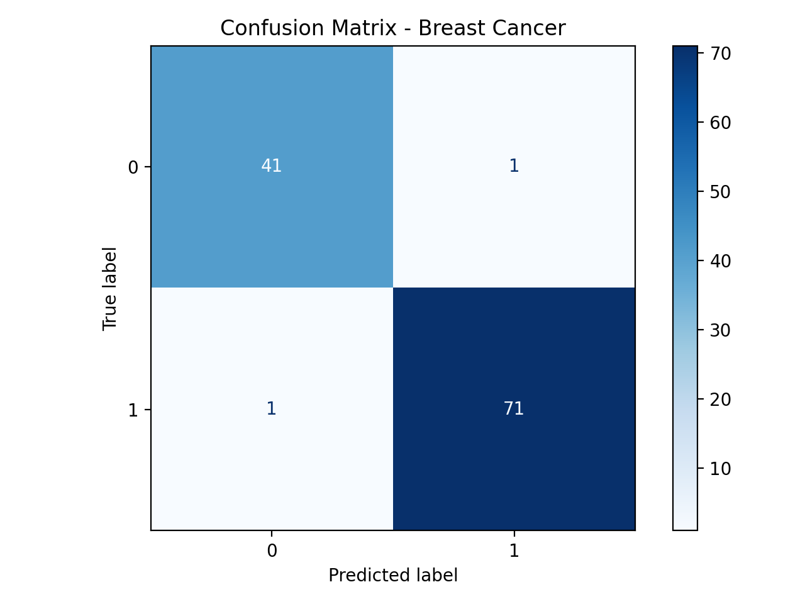
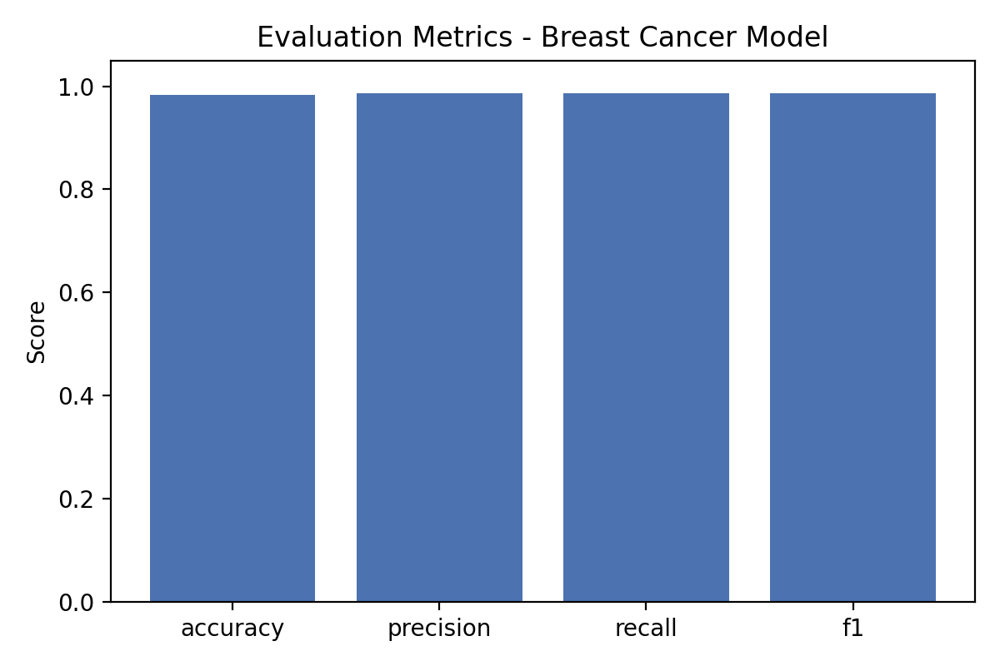

# Tabular ML Pipeline

A lightweight yet extensible machine-learning project that demonstrates good engineering practices around data loading, model training, evaluation, and artifact management for tabular classification tasks. The project uses scikit-learn datasets to keep the focus on the workflow rather than data wrangling.

## Features

- Modular Python package with clear separation of configuration, data loading, modelling, metrics, and persistence concerns
- Command-line interface that supports YAML-based configuration and runtime overrides
- Automatic export of the trained model, evaluation metrics, and a plain-text classification report
- Ready-to-run defaults using open datasets from scikit-learn
- Pytest smoke test to verify the training pipeline executes without errors

## Getting Started

1. Create and activate a Python 3.10+ virtual environment.

   ```bash
   python -m venv .venv
   source .venv/bin/activate
   ```

2. Install the package (and optional testing tools).

   ```bash
   pip install -e .[test]
   ```

3. Run the training pipeline using the default configuration.

   ```bash
   ml-project --config configs/default.yaml
   ```

4. Override settings on the fly without editing the YAML file.

   ```bash
   ml-project --dataset wine --model-type random_forest --output-dir custom_artifacts
   ```

5. Inspect the generated artifacts under the chosen output directory. Each run produces:

   - `{timestamp}.joblib` – persisted model pipeline
   - `{timestamp}_metrics.json` – evaluation metrics as JSON
   - `{timestamp}_report.txt` – scikit-learn classification report

## Configuration

Configuration is managed via the `TrainingConfig` dataclass in `src/ml_project/config.py`. You can supply overrides through YAML files (see `configs/default.yaml` for an example) or command-line arguments. The supported options cover dataset choice, train/test split, random seeds, and model-specific hyperparameters for logistic regression and random forest classifiers.

## Project Layout

```
.
├── README.md
├── requirements.txt
├── pyproject.toml
├── configs/
│   └── default.yaml
├── src/
│   └── ml_project/
│       ├── __init__.py
│       ├── cli.py
│       ├── config.py
│       ├── data.py
│       ├── metrics.py
│       ├── model.py
│       └── pipeline.py
├── tests/
│   └── test_pipeline.py
└── artifacts/
```

## Results

The default setup focuses on early breast-cancer detection using the Wisconsin Diagnostic Breast Cancer dataset. Running the pipeline with `configs/default.yaml` reproduces the following performance:





## Testing

Run the smoke test suite with pytest to ensure the pipeline executes end-to-end.

```bash
pytest
```

## Extending

- Swap in custom datasets by adding new loader functions to `src/ml_project/data.py` and exposing them through `_LOADERS`.
- Introduce new models by providing a builder in `src/ml_project/model.py` and threading configuration fields through `TrainingConfig`.
- Record additional evaluation metrics in `src/ml_project/metrics.py` or log them to experiment tracking tools.
